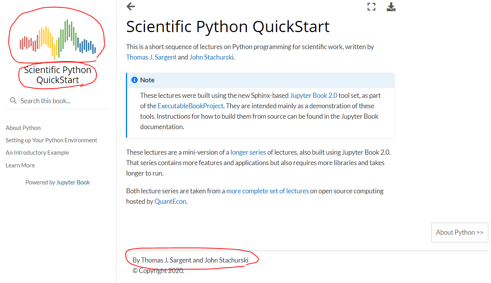
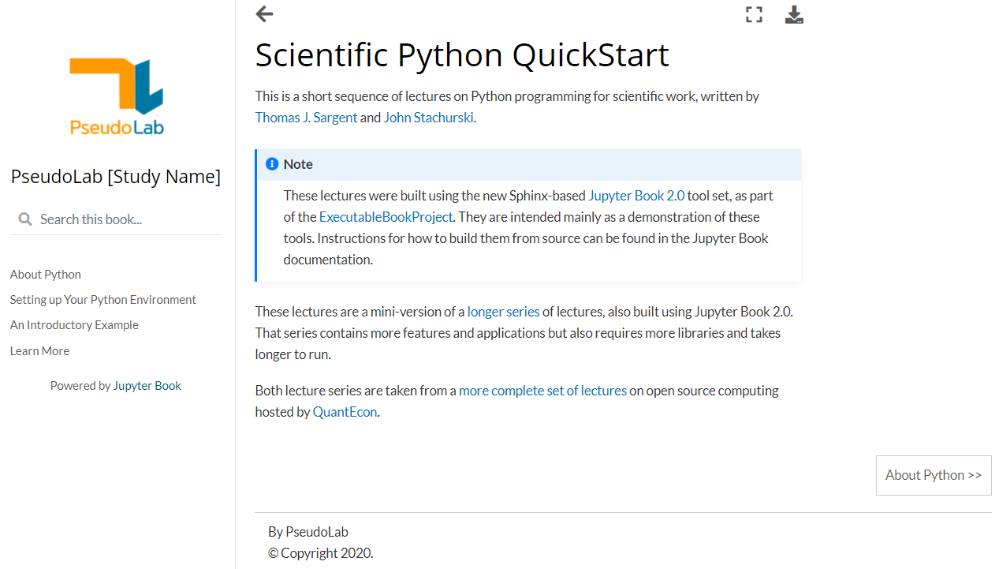
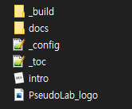

# Step 2. template 내용 수정

이번 단계에서는 step 1에서 생성한 template의 내용을 본인 니즈에 맞게 수정하는 법을 배울 것이다. template을 수정하기 위해선 

1. 환경설정 내용이 담긴`_config.yml`파일
2. Jupyter Book에 표출할 컨텐츠 파일
3. 컨텐츠 파일의 목차 순서를 결정하는 `_toc.yml`파일

위 3개의 요소들을 수정해야 한다. 


## 1. _config.yml 파일 수정

`_config.yml`파일은 본인이 주로 사용하는 텍스트 에디터로 열면 된다. 해당 파일에서 수정해야 할 것들에 대해 확인해보자. 


### 1-1. title, author, logo 수정

```
title: Scientific Python QuickStart
author: Thomas J. Sargent and John Stachurski
logo: 'qe-logo-large.png'
```

`_config`파일을 열면 가장 먼저 `title`, `author`, `logo` 키 값이 존재한다. 해당 값들이 담당하는 내용은 아래와 같다. 



- `title`: 좌측 상단에 위치한 로고 아래에 있는 책 제목을 수정
- `author`: 페이지 하단에 있는 `By [author]` 을 수정
- `logo`: 좌측 상단에 표출 되는 로고 이미지를 수정

`logo`는 상대 경로를 입력 받는다. 즉, `qe-logo-large.png`파일과 `_config.yml`파일이 같은 폴더 내에 위치 하므로 `qe-logo-large.png` 값만 입력을 해준 것이다. 

이번 튜토리얼에서는 `title`, `author`, 그리고 `logo`를 가짜연구소 관련 내용으로 수정해보겠다. 독자들은 각자 본인 니즈에 맞는 내용들로 입력하면 될 것이다. 

```
title: PseudoLab [Study Name]
author: PseudoLab
logo: 'PseudoLab_logo.png'
```

그리고 나서 `jupyter-book build [책이 위치한 경로]` 명령어를 활용해 다시 한번 `build`를 실시해보겠다. 

```
jupyter-book build mini_book
```

생성된 링크를 브라우저에 붙여넣어 이동해보면 아래 그림과 같이 `title`, `author`, `logo`가 수정된 것을 확인할 수 있다. 




### 1-2. description 수정

`description` 키에는 책에 대한 간략한 설명을 적어주면 된다. 

```
description: >-
  Basic Jupyter Book template for PseudoLab studies
```


### 1-3. execute_notebooks 수정

`execute`의 하위 키인 `execute_notebooks`키에는 Jupyter Book을 `build`할 때 `.ipynb`파일의 실행 여부를 결정한다. `build`를 할 때 마다 셀을 실행시키는 것은 번거롭기 때문에 `off`로 설정해준다.  

```
execute:
  execute_notebooks: off 
```


### 1-4. repository 수정

`repository` 키에는 Github 버튼을 눌렀을 시 이동하는 곳의 경로를 입력해주면 된다. 이번 튜토리얼이 끝나면 완성될 Jupyter Book을 업로드할 예정인 원격 repository의 경로를 입력해주면 된다. 필자는 아래와 같이 경로를 수정했다. 

```
repository:
  url: https://github.com/pseudo-lab/Jupyter-Book-Template
  path_to_book: "book" 
```

- `url`: 원격 repository 경로 입력
- `path_to_book`: 원격 repo 내에 Jupyter Book 구성 파일이 존재하는 폴더명 입력 


### 1-5. html 추가

`html`키를 추가 하는 이유는 favicon과 Github 버튼, 그리고 댓글 기능을 추가하기 위해서다. favicon은 Chrome 탭창에 나타나는 작은 아이콘을 뜻한다. 


다음과 같이 `html`키와 하위 키인 `favicon`을 추가한 후, favicon으로 사용할 이미지의 상대 경로를 입력해주면 된다. 

```
html:
  favicon: 'PseudoLab_logo.png'
```

Github 버튼은 페이지 상단에 추가가 되며, 앞서 `repository` 키 값에 설정한 `url/path_to_book` 경로로 이동하게 된다. 또한 각 컨텐츠 페이지 별로 버튼만 누르면 Github Issue를 생성하게 해준다. 아래 코드로 추가 할 수 있다. 

```
html:
  favicon: 'PseudoLab_logo.png'
  use_issues_button: true
  use_repository_button: true
```

*댓글 기능은 추후 정리 예정*


### 1-6. exclude_patterns 추가 (Optional)

Jupyter Book이 올바르게 `build`되기 위해선 폴더내의 모든 `.ipynb`파일과 `.md`파일은 `_toc.yml`파일에 목차로 등재가 돼야 한다. `_toc.yml`에 등재되지 않은 파일이 존재한다면 `build`시 오류가 발생한다. 이를 해결하는 방법은 크게 두가지가 있다. 

1. `exclude_patterns` 키 추가

```
exclude_patterns: [draft/*]
```

위 코드를 `_config.yml`에 추가하면 `draft` 폴더 내에 있는 모든 파일은 `build`시 제외하겠다라는 의미가 된다. 그러므로 `_toc.yml`에 기록하지 않은 파일들을 `draft`폴더 내에 모두 위치시켜 `build`시 발생하는 오류를 회피할 수 있다. 

2. `only_build_toc_files` 키 추가

다른 방법은 `only_build_toc_files`키를 추가 하여 `_toc.yml`파일에 등재된 파일들만 `build`를 실시하는 방법이다. 

```
only_build_toc_files: true
```

위 코드를 `_config.yml`파일에 추가해 `_toc.yml`내 기록된 파일만 `build`되도록 설정할 수 있다. 


## 2. 컨텐츠 파일 추가

`_config.yml` 파일 설정이 끝났으므로, Jupyter Book에 표출될 컨텐츠를 수정해보겠다.


### 2-1. `docs` 폴더 내부에 있는 파일 삭제

 `mini_book`내에 위치한 `docs`폴더 내부에 컨텐츠 파일들이 존재한다. `quantecon-mini-example`에서 기본적으로 제공하는 컨텐츠는 사용하지 않을 것이므로 **모두 삭제를 해주겠다**. `about_py.md`, `getting_started.md`, `index.md`, `learn_more.md`, `python_by_example.md`, `quant-econ.bib` 파일을 모두 삭제한다. 


### 2-2. `_bibliography`, `_static` 폴더 삭제

컨텐츠 내용을 수정함에 따라 더 이상 필요가 없어진 `_bibliography` 폴더와 `_static`폴더를 삭제해준다. 


### 2-3. markdown 예시 파일 생성

그 후, markdown 문법 예시를 보여주기 위해 아래의 내용으로 markdown 문서를 작성해서 `markdown-example.md` 파일명으로 `docs`폴더 내에 저장하겠다. 

```
# markdown 예시

Jupyter Book은 markdown 문서를 지원합니다. 

아래와 같은 예시 코드를 입력하면 markdown 문법이 적용됩니다. 

​```
# This is an <h1> tag
## This is an <h2> tag
###### This is an <h6> tag

*This text will be italic*
_This will also be italic_

**This text will be bold**
__This will also be bold__

_You **can** combine them_

* Item 1
* Item 2
  * Item 2a
  * Item 2b

1. Item 1
1. Item 2
1. Item 3
   1. Item 3a
   1. Item 3b
​```

입력 결과

# This is an <h1> tag
## This is an <h2> tag
###### This is an <h6> tag

*This text will be italic*
_This will also be italic_

**This text will be bold**
__This will also be bold__

_You **can** combine them_

* Item 1
* Item 2
  * Item 2a
  * Item 2b

1. Item 1
1. Item 2
1. Item 3
   1. Item 3a
   1. Item 3b
```


### 2-4. .ipynb 예시 파일 생성

다음으로는 `.ipynb`파일이 구성되는 것을 보여주기 위해 `.ipynb` 예시 파일을 작성하겠다. 아래 코드를 `.ipynb`파일에 **추가** 하고 **실행** 시킨 뒤,  `notebook-example.ipynb` 파일명으로 `docs` 폴더 내부에 저장한다. 

```
import pandas as pd
pd.options.plotting.backend = "plotly"

df = pd.DataFrame(dict(a=[1,3,2], b=[3,2,1]))
fig = df.plot()
fig.show()
```

최종적으로 아래와 같이 2개의 파일이 `docs`폴더 내부에 위치할 것이다. 


### 2-5. 랜딩 페이지 작성

웹사이트에 가장 처음 접속했을 때 표출되는 페이지를 `랜딩 페이지 (Landing Page)`라고 한다. 랜딩 페이지에 해당되는 `intro.md`파일을 작성해보겠다. 

```
# Jupyter Book Template for PseudoLab

가짜연구소 자료 정리를 위한 Jupyter Book Template 입니다. 
```

`intro.md`파일은 `docs`의 부모 경로에 위치 시키는 것을 권장한다. 즉, `_config.yml`파일과 `_toc.yml`파일과 같은 위치에 위치 시키는 것이다. 파일이 `root` 위치로 부터 깊숙히 자리할 때 마다 웹페이지의 URL 길이가 길어지기 때문이다. 

최종적으로 아래와 유사한 구조가 `mini_book`폴더 내에 생성됐을 것이다. 




## 3. _toc.yml 파일 수정

이제 생성한 `.ipynb`파일과 `.md`파일의 목차 순서를 결정하는 `_toc.yml`파일 수정을 진행하겠다. 해당 파일을 텍스트 에디터로 열면 다음과 같은 내용이 있을 것이다. 

```
# format: jb-article
root: intro
  sections:
    - file: docs/about_py
    - file: docs/getting_started
    - file: docs/python_by_example
    - file: docs/learn_more
```

주석문 처리된 첫번째 줄은 삭제해도 된다. 그 다음 줄에 있는 `file` 키에 랜딩 페이지로 사용할 파일을 명시해주면 된다. 상대경로를 입력하면 되는데, `intro.md`파일이 `_toc.yml`과 같은 위치에 있으므로 `intro`를 입력해주면 된다. 여기에서 파일명은 생략한다. 

```
format: jb-article
root: intro
  sections:
    - file: docs/about_py
    - file: docs/getting_started
    - file: docs/python_by_example
    - file: docs/learn_more
```

다음으로 `sections` 내부에 있는 하위 `file`키에 해당하는 값들을 수정해주면 되는데, 본인이 표출하고자 하는 목차 순서대로 구성해주면 된다. `markdown-example.md` 파일을 앞에, 그리고 `notebook-example.ipynb`파일을 뒤에 구성해보겠다. 

```
- file: intro
  sections:
    - file: docs/markdown-example
    - file: docs/notebook-example
```

그 후, 목차명을 정해야 한다. default 값으로 목차명은 해당 컨텐츠 페이지에 markdown `h1` 값으로 구성된 문자열 값을 목차명으로 사용한다. 그 외의 값을 목차명으로 사용하고 싶다면 다음과 같이  `title` 키를 추가해주면 된다. 

```
- file: intro
  sections:
    - file: docs/markdown-example
      title: markdown 예시
    - file: docs/notebook-example
      title: .ipynb 파일 예시
```

위와 같이 구성하는 것 외에도 다양한 방법이 있으니 [공식 홈페이지](https://jupyterbook.org/customize/toc.html)를 참고하기 바란다. 


## 4. 변경된 구조로 `build`하기

기존에 제공되던 `quantecon-mini-example` template을 사용자 니즈에 맞게 다시 구성을 했다. 이제 변경된 구조를 활용해 Jupyter Book을 생성할 것이다. 이번 예시 처럼 파일 컨텐츠 및 파일 목차 구조를 모두 변경할 정도의 대규모 업데이트를 진행했다면 `build`를 하기전에 기존에 `build`한 기록들을 삭제한 후 진행하는 것을 권장한다. 자칫 하다간 경로가 꼬일 수 있기 때문이다. 아래 명령어를 통해 기존에 `build`한 파일을 제거할 수 있다. 

```
jupyter-book clean --all mini_book
```

위 명령어는 `build`가 꼬일 때 마다 사용해주면 웬만한 에러는 해결해준다. 

`clean`을 해준 후 다시 `build`를 하여 새롭게 구성된 template을 확인할 수 있다. 

```
jupyter-book build mini_book
```

지금까지 본인 만의 Jupyter Book template 만드는 과정을 실습해보았다. 다음 단계에서는 Github Pages 기능을 활용해 온라인으로 본인의 Jupyter Book을 배포하는 것을 실습하겠다. 