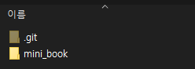

# Step 3. Github Pages를 통한 배포

step 1과 2를 통해 Jupyter Book에서 제공하는 `quantecon-mini-example` template을 본인 니즈에 맞게 수정하고, 로컬에서 수정된 template을 `build`하는 것까지 실습했다. 이번 단계에서는 새로운 template을 웹으로 배포하는 것을 알아보고자 한다. 

## 1. Github Repository 생성

우선 본인이 구축한 Jupyter Book template을 저장할 원격 repository를 생성한다. 이 때 README 파일은 추가 하지 않는다. 


## 2. git clone 및 `mini_book` 폴더 이동하기/이름 변경

그리고 나서 생성된 repo를 로컬 환경에 `clone`한다. 

```
git clone https://github.com/Pseudo-Lab/Jupyter-Book-Template.git
```

`clone` 명령어 뒤에 본인이 생성한 repo 주소를 입력하면 된다. 

step 1과 step 2의 작업물의 최종본은 현재 `quantecon-mini-example` 폴더 내의 `mini_book` 폴더에 모두 위치하고 있을 것이다. `mini_book`폴더 전체를 `clone`한 폴더로 이동 시켜 준다. 필자 같은 경우 `Jupyter-Book-Template` 폴더에 `mini_book`폴더를 이동 시켜 아래와 같은 구조가 생성 됐다. 



또한, 편의를 위해 `mini_book`폴더명을 `book`으로 변경해주겠다. 


## 3. README.md 작성

필요시 README.md 작성을 진행하면 된다. 이 때, README 파일은 `book` 밖에 위치하도록 해준다. Jupyter Book은 모든 `.md` 파일 및 `.ipynb`파일을 `build` 시키는데, `book`내부에 README 파일이 위치할 경우, 원치 않은 README.md 파일로 인해 `build`시 오류가 발생할 수 있기 때문이다. 


## 4. 로컬 repo와 원격 repo 동기화 

`git add`, `git commit`, `git push` 명령어를 통해 로컬에서 진행한 변경사항을 원격 repo에 `push` 해준다. 

```
cd Jupyter-Book-Template
git add .
git commit -m "adding my first book!"
git push
```


## 5. ghp-import 활용한 배포

우선 아래 명령어로 `ghp-import`를 설치한다. 

```
pip install ghp-import
```

그 후 다음 명령어를 활용해 gh-pages branch에 html파일을 적재한다. 

```
ghp-import -n -p -f book/_build/html -m "initial publishing"
```

`jupyter-book build`를 통해 만들어진 html파일들이 `_build/html`폴더 내에 저장돼어 있으므로, 해당 파일 전체를 gh-pages branch에 저장하여 Github Pages 시스템으로 웹 배포를 진행하는 것이다. 

[본인 Github Name].github.io/[repo명] 링크로 접속하면 배포된 Jupyter Book을 볼 수 있다. 이번 예시에서 만든 template은 아래 링크에 배포돼었다. 

```
https://pseudo-lab.github.io/Jupyter-Book-Template/
```

